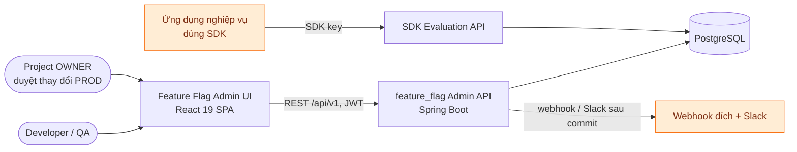
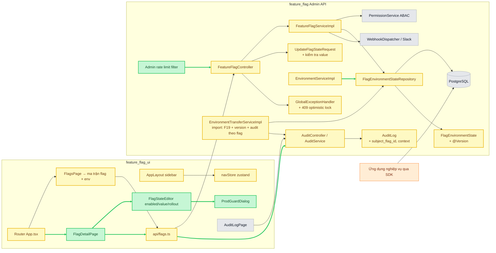
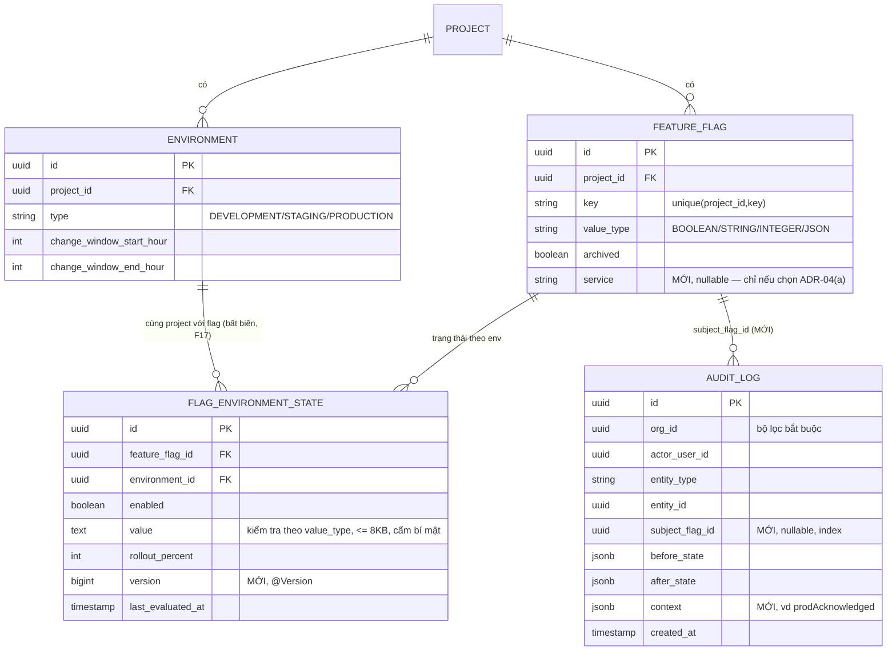
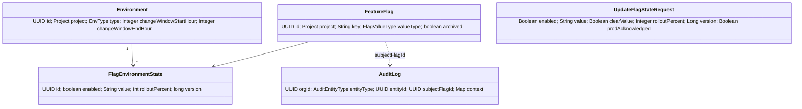

# Solution Design — Điều hướng lấy Flag làm trung tâm (flag-centric) cho Feature Flag UI

> **DRAFT — pre-G0. Chưa có G0 cho tính năng này; không dùng làm bằng chứng G1.**
>
> Người soạn: solution-architect (Maker). Ngày: 2026-10-04 (rev 3 — xử lý phát hiện review P2 vòng 2: import là đường ghi thứ hai (F23), trần `stateIds`, grant khi rời org, thứ tự kiểm tra 404/403; xem `design-walkthrough-notes.md`). Người duyệt dự kiến: Architect + Security (Checker).
> Định dạng theo `chapter-forge/docs/reference-solution-design-doc.md`. Mọi khẳng định dẫn nguồn dạng `file:line`.
> Tiền tố đường dẫn: `UI/` = `feature_flag_ui/src/`, `BE/` = `feature_flag/src/main/java/org/aibles/feature_flag/`, `RES/` = `feature_flag/src/main/resources/`.
> Đánh dấu **[CHƯA XÁC MINH]** cho mọi điều chưa đọc trực tiếp trong code.

---

## 1. Tổng quan & phạm vi

Mục tiêu: cải thiện màn hình quản lý feature flag. Hiện tại người dùng phải đi org → project → **env** → flags, nhưng trong domain flag thuộc **project**, không thuộc env. Đề xuất: bỏ env khỏi cấp điều hướng, đưa env thành **cột / bộ lọc**; thêm trang chi tiết flag xem và sửa trạng thái trên mọi env.

- **Trong phạm vi:** `feature_flag_ui` (routes, layout, trang Flags, trang Flag detail mới, hộp xác nhận PROD); `feature_flag` (endpoint đọc ma trận, lịch sử theo flag, tạo bổ sung state cho env mới, **sửa lỗi có sẵn ở `updateState`**: thiếu kiểm tra env thuộc project (F17), xoá `value` khi toggle (F7), không có khoá lạc quan (F18), không kiểm tra `value` (F19); và **import snapshot** bỏ qua F19/`version`/audit theo flag (F23)).
- **Chỉ là phụ thuộc:** ABAC/PermissionService, AuditService, SDK evaluation (`BE/controller/sdk/EvaluationController.java:33,41`), env clone/export (`BE/controller/admin/EnvironmentTransferController.java:28,35`). Import (`:40`) **không còn chỉ là phụ thuộc** — phải sửa theo F23.
- **Ngoài phạm vi (cần quyết định sản phẩm / Security):** khái niệm "service" để nhóm flag (ADR-04, Q1); cơ chế 4-mắt cho PROD (Q3, đã chuyển lên Security/Compliance).
- Truy vết G0: **chưa có mã yêu cầu** — cần requirements-analyst lập story + AC trước G0.

## 2. Bối cảnh & hiện trạng (có dẫn chứng)

### 2.1 Sơ đồ ngữ cảnh hệ thống



Ranh giới tin cậy: trình duyệt ↔ Admin API (xác thực + ABAC phía server); ứng dụng nghiệp vụ ↔ SDK API (SDK key); Admin API → webhook/Slack (dữ liệu `value` rời hệ thống, `BE/webhook/WebhookDispatcher.java:52-62`, `BE/notification/SlackEventListener.java:27-37`). Tính năng này **không** đổi luồng SDK.

### 2.2 Phát hiện hiện trạng

| # | Phát hiện | Dẫn chứng | Hệ quả |
|---|---|---|---|
| F1 | Chỉ một route cho flags, gắn env trong path; không có route chi tiết flag hay xem chéo env | `UI/App.tsx:22-36`, route flags `:34` | Không xem được một flag trên mọi env |
| F2 | Chọn env trong sidebar rồi điều hướng sang trang flags | `UI/components/layout/AppLayout.tsx:45-47`, `:176-180` | Env là cấp điều hướng bắt buộc |
| F3 | `currentEnv` chỉ nằm trong zustand, khởi tạo `null`, không đọc lại từ URL | `UI/stores/navStore.ts:15-21` | F5/refresh hoặc mở link chia sẻ mất ngữ cảnh env (header env ở `AppLayout.tsx:267-270` biến mất) |
| F4 | Flag thuộc project, unique `(project_id, key)` | `BE/domain/entity/FeatureFlag.java:12-14,27-28` | Flag là thực thể cấp project → nên là cấp điều hướng |
| F5 | Trạng thái theo env ở bảng riêng, unique `(feature_flag_id, environment_id)`; có `enabled`, `value`, `rolloutPercent` (mặc định 100), `lastEvaluatedAt` | `BE/domain/entity/FlagEnvironmentState.java:11-13,35,38,42,54` | Dữ liệu tự nhiên là **ma trận flag × env** |
| F6 | Trang Flags gọi `getFlagState` cho từng flag (N+1) qua `useQueries` | `UI/pages/flags/FlagsPage.tsx:112-115`; API `UI/api/flags.ts:49-50` | 1 + N request cho một env; ma trận K env sẽ là 1 + N×K |
| F7 | **Lỗi có sẵn (đã xác minh bằng đọc code):** toggle chỉ gửi `{enabled}`; server gán `state.setValue(request.getValue())` **vô điều kiện**, trong khi `rolloutPercent` có kiểm tra null | UI `FlagsPage.tsx:43`; BE `FeatureFlagServiceImpl.java:235-237` | Bật/tắt một flag không phải BOOLEAN xoá `value` về null; giá trị null này còn đi vào audit (`:240-246`), webhook và Slack (`:248-258`). **Ảnh hưởng thực tế lên DB chưa được kiểm chứng** — cần test tích hợp + rà audit (Q6) |
| F8 | Kiểu `FlagState` phía UI thiếu `rolloutPercent`, `lastEvaluatedAt` dù BE trả về | `UI/api/flags.ts:17-22` vs `BE/.../FeatureFlagServiceImpl.java:283-291` | Không hiển thị/sửa được rollout |
| F9 | PROD: action `FLAG_STATE_UPDATE` bị nâng thành `FLAG_STATE_UPDATE_PRODUCTION` (OWNER-only) và bị chặn ngoài change window | `BE/service/impl/PermissionService.java:61-66,97,172-188,220-228`; mô tả UI `UI/api/environments.ts:13-15`, `UI/api/abac.ts:67-68` | UI chỉ biết qua lỗi server; không có hộp xác nhận PROD |
| F10 | Khi tạo flag, server tự tạo state (enabled=false) cho **mọi env đang có** | `BE/.../FeatureFlagServiceImpl.java:76-82` | Đã xác minh |
| F11 | Tạo env mới **không** tạo state cho các flag đã có (không có `FlagEnvironmentState.builder` trong `EnvironmentServiceImpl`). **Clone** sao chép mọi state của env nguồn sang env mới cùng project (`EnvironmentTransferServiceImpl.java:53-86`); **import** tạo state cho mọi env khi tạo flag mới (`:246-266`) | grep toàn `BE/` | Ô ma trận có thể **thiếu state** → `getState` trả 404 (`FeatureFlagServiceImpl.java:203-207`). **Đã xác minh:** import cho flag **đã có** nhưng thiếu state ở env đích sẽ **tạo** state đó theo snapshot, bất kể `conflictStrategy` (`EnvironmentTransferServiceImpl.java:217-226`) — đây là một đường tạo state ngoài ADR-03, xem F23 |
| F12 | `GET /flags` phân trang mặc định 20; server **kẹp tối đa 100** cho mọi `Pageable`; UI chỉ lấy `content` | `BE/controller/admin/FeatureFlagController.java:34-38`; `BE/config/PaginationConfig.java:21-22,27`; `UI/api/page.ts` (`pageItems`) | Project > 20 flag chỉ hiện 20 flag đầu [CHƯA XÁC MINH trên môi trường chạy] |
| F13 | Audit CHANGE_STATE ghi `entityType=FLAG_STATE`, `entityId = state.id` (không phải flag id); bảng `audit_log` chỉ có `org_id`, `entity_type`, `entity_id`, không có cột flag; repo chỉ có `findByOrgId`. JSON `before/after` có trường `flagId` (từ `FlagStateResponse`) nhưng không có index | `BE/.../FeatureFlagServiceImpl.java:240-246,285`; `BE/domain/entity/AuditLog.java:49-62`; `BE/repository/AuditLogRepository.java:12`; `BE/controller/admin/AuditController.java:29-38` | Không lấy được "lịch sử của một flag" nếu không thêm bộ lọc / cột |
| F14 | "Archive" gọi `DELETE /flags/{id}` (BE thực hiện archive mềm) | `UI/api/flags.ts:40`; `BE/controller/admin/FeatureFlagController.java:56`; `FeatureFlagServiceImpl.java:148-165` | Ngữ nghĩa HTTP gây hiểu nhầm; giữ nguyên ở pha này |
| F15 | Màu hex cứng | `UI/pages/flags/FlagsPage.tsx:67-68,87-88,215-219` | Khó theming/dark mode; chuyển sang token Tailwind 4 |
| F16 | Không có khái niệm "service" trong domain | grep `BE/domain` [xác minh bằng mô tả của caller, chưa grep lại] | Ý "danh sách flag theo service" cần quyết định mô hình |
| F17 | **Lỗi có sẵn (đã xác minh):** `updateState` tải env theo `envId` rồi gọi `check` với `projectId` **của flag** và env đó, **không** khẳng định `environment.project == flag.project`. `getState` cũng không khẳng định (chỉ tra cặp) | `BE/.../FeatureFlagServiceImpl.java:198-209,217-223`; `PermissionService.java:200-207,305-307` | Hôm nay ghi chéo project **không** khả thi vì mọi đường tạo state đều dùng env cùng project (F10, F11) nên tra cặp ở `:225-229` trả 404. Nhưng (a) quyết định quyền dựa trên `type`/change window của **env lạ** → lộ thông tin (403 "elevated" vs 404 cho env PROD/không-PROD của project khác); (b) bất kỳ thay đổi nào tạo state theo yêu cầu (lazy-create) sẽ biến thành IDOR ghi. Phải sửa ở pha 2 |
| F18 | `FlagEnvironmentState` **không có `@Version`** (grep `@Version` toàn `BE/`: 0 kết quả); `GlobalExceptionHandler` chỉ trả 409 cho `DuplicateResourceException`, không có handler cho lỗi optimistic lock | `BE/domain/entity/FlagEnvironmentState.java:19-63`; `BE/exception/GlobalExceptionHandler.java:33-41,125` | Hai người sửa cùng ô → **ghi đè im lặng** (last-write-wins). Không có 409 nào để UI rollback |
| F19 | `UpdateFlagStateRequest.value` không có ràng buộc (`@Size`, kiểu); server không phân tích `value` theo `valueType` khi sửa state (chỉ import so khớp `valueType` của flag, `EnvironmentTransferServiceImpl.java:207-214`). `FlagValueType` = BOOLEAN/STRING/INTEGER/JSON | `BE/dto/request/UpdateFlagStateRequest.java:9`; `BE/domain/enums/FlagValueType.java` | Chuỗi tuỳ ý, không giới hạn độ dài, đi vào DB (`TEXT`), audit, webhook, Slack |
| F20 | Change window so với `LocalTime.now(clock)`, `Clock.systemDefaultZone()`; env không có trường múi giờ; không thấy cấu hình TZ trong `application.properties`/`Dockerfile` | `BE/config/AppConfig.java:12`; `PermissionService.java:226`; `BE/domain/entity/Environment.java:50,53` | Giờ window phụ thuộc múi giờ JVM; client không thể tính lại chính xác. Múi giờ thực tế khi chạy: [CHƯA XÁC MINH] |
| F21 | `AUDIT_READ` có trong vai trò VIEWER của org; `AuditService.list` kiểm tra ở **phạm vi org**, nơi grant cấp project không được tính. Mọi grant cấp project yêu cầu người nhận là thành viên org, và `role` của thành viên `NOT NULL` | `PermissionService.java:69-70,143-145,230`; `AuditService.java:71-74`; `ProjectGrantServiceImpl.java:89-92`; `OrganizationMember.java:34-35` | Mọi người có grant project đều ít nhất là VIEWER của org → **đọc được toàn bộ audit org**. Xem giải quyết xung đột ở §8.3 |
| F22 | Rate limit chỉ có cho `/api/v1/auth/**` và `/api/v1/sdk/**`; Admin API không có | `BE/security/ratelimit/AuthRateLimitFilter.java:17,26`; `SdkRateLimitFilter.java:9`; `RES/application.properties:26-31` | Endpoint ma trận (nặng) không được giới hạn tần suất |
| F23 | **Lỗi có sẵn (đã xác minh) — import snapshot là đường ghi state thứ hai.** `importSnapshot` ghi đè `enabled`/`value`/`rolloutPercent` của state có sẵn (`:237-241`), tạo state mới cho flag có sẵn (`:217-226`) và tạo flag mới kèm state (`:246-266`) mà **không** kiểm tra `value` theo F19 (`FlagEntry.value` không có ràng buộc, `BE/dto/request/ImportEnvironmentRequest.java:67`; chỉ so `valueType` khai báo, `:207-215`) và **không** kiểm tra `version`. Audit chỉ ghi **một** bản `ENVIRONMENT`/`IMPORT` cho env, `after` = bộ đếm `created/updated/unchanged/skipped` (`:169-178`; `ImportResultResponse.java:25-30`) — không có before/after theo flag. Quyền: `FLAG_CREATE` + `FLAG_STATE_UPDATE` trên env đích, nên nâng quyền PROD/change window vẫn áp dụng (`:141-146`) | `BE/service/impl/EnvironmentTransferServiceImpl.java:128-178,195-266` | (a) Vượt qua M-VAL/F19 và ADR-07: người có quyền import ghi được `value` sai kiểu/quá dài và ghi đè im lặng thay đổi đồng thời; (b) **lỗ hổng chối bỏ (repudiation)**: lịch sử theo flag (`subject_flag_id`, §6.3 mục 5) sẽ không bao giờ thấy thay đổi đến từ import; import cũng không phát sự kiện nào nên webhook/Slack không được báo (grep `publishEvent`: không có trong `EnvironmentTransferServiceImpl`) |

## 3. Các phương án đã cân nhắc

| Phương án | Mô tả | Ưu | Nhược |
|---|---|---|---|
| A. Giữ env-first | Sửa lỗi nhỏ (URL, N+1) nhưng giữ org→project→env→flags | Ít thay đổi | Không giải quyết vấn đề gốc; không so sánh được giữa env; promote DEV→PROD phải đổi trang nhiều lần |
| B. Flag-centric ma trận thuần | Flags list là bảng flag × env; env chỉ là cột | So sánh tức thì; khớp domain (F4, F5) | Nhiều env (>6) làm bảng rộng; thao tác hàng loạt trên PROD dễ nhầm |
| **C. Hybrid (đề xuất)** | Flags list = ma trận chip theo env + bộ lọc `?env=` để "tập trung" một env; Flag detail = thẻ theo env, sửa enabled/value/rollout | Giữ luồng "làm việc trong một env"; URL chia sẻ được; PROD có cổng xác nhận riêng | Hai chế độ hiển thị cần thiết kế cẩn thận; cần endpoint ma trận để không N×K |

Cải tiến so với ý tưởng gốc của người dùng ("liệt kê flag theo service, mỗi flag hiện các env"): (1) không chờ quyết định "service" — dùng **project** làm đơn vị nhóm ngay; (2) env là **bộ lọc trong URL** chứ không phải state toàn cục; (3) thêm cổng PROD và lịch sử thay đổi trên trang chi tiết.

## 4. Mục tiêu NFR (đề xuất, cần xác nhận ở G0)

| NFR | Mục tiêu | Ghi chú |
|---|---|---|
| Số request khi mở Flags list | ≤ 3 (envs, flags, matrix) bất kể N, K | Hiện 1 + N (F6) |
| Độ trễ endpoint ma trận | p95 ≤ 300 ms với 100 flag/trang × 20 env | Một truy vấn join, phân trang theo flag, trang tối đa 100 (F12) |
| Thời gian hiển thị Flags list | LCP ≤ 2 s trên mạng nội bộ | |
| Tính đúng | 0 trường hợp toggle làm mất `value`; 0 ghi đè im lặng khi sửa đồng thời | F7 (ADR-05), F18 (ADR-07), có test hồi quy |
| Cô lập dữ liệu | 0 endpoint nhận `envId`/`projectId`/`flagId` mà không khẳng định quan hệ sở hữu | F17, §8.1, test IDOR §11.1 |
| Khả dụng | Theo SLA hiện hành của Admin API [CHƯA XÁC MINH con số] | Admin UI không nằm trên đường SDK |
| Quy mô | ≤ 1 000 flag/project, ≤ 20 env/project | Giả định, cần PO xác nhận |
| Giới hạn tần suất | Endpoint ma trận: ≤ 60 request/phút/người dùng (đề xuất) | F22; con số cần Security xác nhận |
| Truy cập | WCAG 2.1 AA cho chip trạng thái (không chỉ dựa vào màu) | |

## 5. Solution Design Diagram



**Chú giải:** 🟢 xanh lá = mới (danh sách việc phải xây) · 🟡 vàng = sửa đổi (có rủi ro hồi quy) · ⚪ xám = có sẵn, không đổi · 🟠 cam = bên ngoài/bên thứ ba. Mũi tên xanh = quan hệ mới. (`APPS → DB` vẽ tượng trưng cho luồng SDK có sẵn, thực tế đi qua `EvaluationController`.)

### 5.1 Component inventory

| Thành phần | Loại | Trách nhiệm | Thay đổi | Dẫn chứng |
|---|---|---|---|---|
| FlagDetailPage | 🟢 Mới | Thẻ theo env, lịch sử thay đổi | Xây mới, route `/orgs/:o/projects/:p/flags/:flagId` | Không có route tương tự (`UI/App.tsx:22-36`) |
| FlagStateEditor | 🟢 Mới | Sửa `enabled` + `value` theo `valueType` + `rolloutPercent`; gửi `version` | Xây mới; luôn gửi đủ trường | F7, F8, F18 |
| ProdGuardDialog | 🟢 Mới | Xác nhận PROD: tên env, diff before/after, trạng thái window **do server trả về**, yêu cầu OWNER | Xây mới; **chỉ là UX tư vấn**, server quyết định | F9, F20 |
| Admin rate limit filter | 🟢 Mới | Giới hạn tần suất theo người dùng cho endpoint ma trận | Xây mới theo mẫu `AbstractRateLimitFilter` | F22 |
| Router `App.tsx` | 🟡 Sửa | Thêm `/projects/:p/flags`, `/flags/:flagId`; route cũ redirect sang `?env=` | Sửa | `UI/App.tsx:34` |
| AppLayout | 🟡 Sửa | Bỏ env switcher khỏi sidebar; mục "Flags" dưới project | Sửa | `AppLayout.tsx:45-47,176-180` |
| navStore | 🟡 Sửa | Bỏ `currentEnv`; env lấy từ URL `?env=` (đã kiểm tra hợp lệ) | Sửa | `navStore.ts:9,18,21` |
| FlagsPage | 🟡 Sửa | Ma trận chip theo env; chế độ tập trung một env; bỏ N+1; token màu | Sửa lớn (545 dòng) | F6, F15 |
| `api/flags.ts` | 🟡 Sửa | Thêm `rolloutPercent`, `lastEvaluatedAt`, `version`; hàm `getFlagMatrix`, `getFlagStates`, `getFlagHistory` | Sửa | `UI/api/flags.ts:17-22,52-53` |
| FeatureFlagController | 🟡 Sửa | Thêm `GET /flags/environment-states?projectId=`, `GET /flags/{id}/environments`, `GET /flags/{id}/audit-log` | Sửa | `FeatureFlagController.java:21,80-90` |
| FeatureFlagServiceImpl | 🟡 Sửa | Dịch vụ ma trận; **khẳng định env thuộc project của flag** (F17); giữ `value` khi null (ADR-05); kiểm tra `version` (ADR-07); ghi `subject_flag_id` | Sửa | `FeatureFlagServiceImpl.java:198-246` |
| UpdateFlagStateRequest | 🟡 Sửa | `@Size(max)` cho `value`; `clearValue`; `version` | Sửa | F19, `UpdateFlagStateRequest.java:9` |
| FlagEnvironmentState | 🟡 Sửa | Thêm cột `version` + `@Version` | Sửa + Liquibase `019` | F18 |
| GlobalExceptionHandler | 🟡 Sửa | `ObjectOptimisticLockingFailureException` → 409 | Sửa | `GlobalExceptionHandler.java:33-41` |
| FlagEnvironmentStateRepository | 🟡 Sửa | Truy vấn join flag × env **ràng buộc cả `flag.project_id` và `env.project_id` = :projectId** | Thêm 1 query | `FlagEnvironmentStateRepository.java:25` |
| AuditController / AuditService / AuditLogRepository | 🟡 Sửa | Lịch sử theo flag, luôn lọc `org_id` | Sửa | F13, F21 |
| AuditLog | 🟡 Sửa | Cột `subject_flag_id` (nullable, index) + `context` jsonb (ghi nhận xác nhận PROD) | Sửa + Liquibase `020` | ADR-06 |
| EnvironmentTransferServiceImpl (import) | 🟡 Sửa | Import áp dụng **cùng** kiểm tra `value` (F19), quy tắc `version` (ADR-07) và ghi audit **theo từng flag** như `updateState` | Sửa (pha 0b cho F19 + audit; pha 2 cho `version`) | F23, `EnvironmentTransferServiceImpl.java:169-178,217-241` |
| EnvironmentServiceImpl | 🟡 Sửa | Tạo state mặc định cho các flag hiện có khi tạo env | Sửa (ADR-03; **không** lazy-create) | F11 |
| PermissionService | ⚪ Có sẵn | ABAC, nâng quyền PROD, change window | Không đổi logic quyết định | `PermissionService.java:61-66,172-188,220-228` |
| WebhookDispatcher / Slack | ⚪ Có sẵn | Gửi `value` cũ/mới ra ngoài | Không đổi; là lý do cấm bí mật trong `value` | `WebhookDispatcher.java:52-62`, `SlackEventListener.java:27-37` |
| AuditLogPage | ⚪ Có sẵn | Nhật ký org | Không đổi | `UI/App.tsx:30` |
| PostgreSQL | ⚪ Có sẵn | Lưu trữ | 2 changeset bổ sung ở pha 2 (§6.4) | — |
| Ứng dụng nghiệp vụ (SDK) | 🟠 Bên ngoài | Đánh giá flag | Không đổi | `EvaluationController.java:33,41` |

## 6. HLD / LLD

### 6.1 Kiến trúc thông tin (IA) mới

```
/orgs/:o/projects/:p                 → Environments (giữ nguyên, quản trị env/key)
/orgs/:o/projects/:p/flags           → Flags list (ma trận)          ?env=<uuid>&q=&status=&archived=
/orgs/:o/projects/:p/flags/:flagId   → Flag detail                   ?env=<uuid> (thẻ được mở)
/orgs/:o/projects/:p/envs/:e/flags   → redirect → /flags?env=:e      (giữ link cũ)
```

- **Flags list:** mỗi hàng = flag; mỗi cột = env, sắp DEV → STAGING → PROD (`UI/api/abac.ts:55-57`). Chip = bật/tắt + giá trị rút gọn + `rollout%` nếu < 100; cột PROD có viền/biểu tượng khoá. Ô thiếu state hiển thị "chưa cấu hình" (F11), không lỗi, **không** có nút tạo state từ ô. Khi `?env=` được chọn: cột đó mở rộng thành chế độ chi tiết, toggle nhanh **chỉ** cho flag BOOLEAN và env không phải PROD.
- **Kiểm tra `?env=`:** UI chỉ chấp nhận `?env=` nếu là UUID hợp lệ **và** có trong danh sách env của project hiện tại (đã tải); nếu không → bỏ tham số, hiện ma trận đầy đủ, không gọi API với giá trị đó. Đây là UX; ranh giới bảo mật là khẳng định phía server (§8.1).
- **Flag detail:** header (key, mô tả, loại, hết hạn, archive); lưới thẻ env; mỗi thẻ mở `FlagStateEditor`; tab "Lịch sử" (pha 2). "So sánh/sao chép cấu hình giữa env" để sau (Q4).
- **State:** bỏ `currentEnv` trong zustand; env là URL search param (`useSearchParams`, react-router 7) (F3).

### 6.2 Dữ liệu phía UI (TanStack Query 5)

- Keys: `['flags', projectId]`, `['flag-matrix', projectId]`, `['flag-states', flagId]`, `['flag-history', flagId]`.
- Pha 1 (không đổi BE): ma trận dựng từ `getFlagState` theo cặp, **tải lười** theo cột hiển thị + `staleTime`; giới hạn đồng thời.
- Pha 2: một lời gọi `getFlagMatrix(projectId)`.
- **Sửa state & xung đột:**
  - *Trước ADR-07 (pha 0–1):* server **không** phát hiện xung đột (F18) — không có 409; ghi sau thắng. Optimistic update chỉ rollback khi request lỗi (400/403/404/5xx). UI phải **tải lại state ngay trước khi mở editor** và trước khi gửi PROD, và hiển thị cảnh báo "có thể ghi đè thay đổi đồng thời".
  - *Sau ADR-07 (pha 2):* UI gửi `version` đọc được; server trả **409** khi `version` lệch → rollback ô, tải lại, hiển thị diff "người khác vừa sửa". Sau mọi lần thành công: invalidate `flag-matrix` + `flag-states` + `flag-history`.

### 6.3 Thay đổi backend (pha 2)

1. **Sửa lỗi có sẵn F17 (ưu tiên cao nhất, không phụ thuộc UI):** trong `updateState` và `getState`, sau khi tải flag và env: nếu `!environment.getProject().getId().equals(flag.getProject().getId())` → `ResourceNotFoundException` (**404**, không 403, để không xác nhận sự tồn tại của env lạ). Áp dụng cùng quy tắc cho **mọi** endpoint hiện có và mới nhận `envId`/`?env=`.
   **Thứ tự kiểm tra (rev 3, chốt):** (i) tải flag (không có → 404); (ii) `check(action, project(flag.projectId))` — kiểm quyền cơ bản ở phạm vi project, **không** gắn env (cùng dạng `ResourceRef.project` mà import dry-run đang dùng, `EnvironmentTransferServiceImpl.java:143-146`) → thiếu quyền → **403**; (iii) tải env và khẳng định env ∈ project của flag → **404**; (iv) `check(action, environment(projectId, env))` để áp nâng quyền PROD + change window → 403. Lý do: nếu khẳng định env (iii) chạy trước mọi kiểm quyền thì người **không có quyền** trên project của flag phân biệt được 404 (env không thuộc project) với 403 (env thuộc project) → dò được env nào thuộc project nào. Đặt (ii) trước (iii) khiến người không có quyền luôn nhận 403; người có quyền nhận 404 cho mọi env lạ, bất kể env lạ là PROD hay không (T-IDOR-1); và (iv) vẫn chỉ đọc thuộc tính của env **đã được khẳng định** cùng project. Rò rỉ còn lại được chấp nhận: 404 vs 403 cho **sự tồn tại của flag** — hành vi chung của mọi endpoint hiện có, id là UUID khó đoán (mức Thấp).
2. `GET /api/v1/flags/environment-states?projectId=&page=&size=` — ma trận phân trang theo **flag**. Kiểm `FLAG_READ` trên `projectId` (như `FeatureFlagServiceImpl.java:105-110`). Truy vấn **phải** ràng buộc `f.project_id = :projectId AND e.project_id = :projectId` (không tin bất kỳ id nào ngoài `projectId` đã qua kiểm quyền); trang flag lấy bằng `findAllByProjectId…` rồi `JOIN FETCH` state theo `flag_id IN (:pageIds)` **và** `project_id`. `size` ≤ 100 (kẹp toàn cục, `PaginationConfig.java:22`). Có rate limit (NFR §4, F22).
3. `GET /api/v1/flags/{flagId}/environments` — mọi state của một flag; project lấy từ flag (không nhận từ client); kiểm `FLAG_READ` như `get` (`:113-118`); lọc thêm `env.project_id = flag.project_id` (phòng thủ chiều sâu).
4. `PUT /flags/{id}/environments/{envId}`:
   - khẳng định env ∈ project của flag (mục 1);
   - `value == null` và `clearValue != true` → **giữ nguyên** `value` (ADR-05); `clearValue == true` → đặt null; `clearValue == true` kèm `value != null` → 400;
   - kiểm tra `value` (F19): `@Size(max = 8192)` [con số đề xuất, Q10]; phân tích theo `flag.valueType`: BOOLEAN → chỉ `"true"`/`"false"`/null, INTEGER → `Long.parseLong`, JSON → parse Jackson hợp lệ, STRING → chỉ giới hạn độ dài; sai → 400 (`InvalidRequestException`);
   - `version` bắt buộc; lệch → 409 (ADR-07);
   - nhận trường tuỳ chọn `prodAcknowledged: true` từ ProdGuardDialog, ghi vào `audit_log.context` (§8.2) — **do client khai báo, không phải kiểm soát**.
5. Lịch sử theo flag: `GET /api/v1/flags/{flagId}/audit-log?page=&size=`. Server tải flag → lấy `orgId` **từ flag** (không từ path/query) → `check(AUDIT_READ, org(orgId))` (giữ nguyên mô hình quyền hiện có, §8.3) → truy vấn `WHERE org_id = :orgId AND (subject_flag_id = :flagId OR (entity_type = 'FLAG_STATE' AND entity_id IN (:stateIds)) OR (entity_type = 'FEATURE_FLAG' AND entity_id = :flagId))`. `stateIds` do server tự lấy từ `findAllByFeatureFlagId` (không nhận từ client), giới hạn ≤ 20 (= trần env/project, §4); vượt → **400** (`InvalidRequestException`) kèm log cảnh báo. **Không cắt bớt**: cắt im lặng sẽ giấu một phần lịch sử của flag mà người đọc không biết — đúng loại lỗ hổng chối bỏ mà endpoint này phải đóng; lỗi rõ ràng buộc phải xem lại trần ở §4. Không mở rộng `GET /organisations/{orgId}/audit-log` bằng danh sách `entityIds` từ client.
6. Ghi `subject_flag_id = flag.id` cho mọi audit `FLAG_STATE`/`FEATURE_FLAG` từ nay (ADR-06).
7. Tạo state mặc định cho flag hiện có khi tạo env (F11) + backfill — ADR-03.
8. Thêm rate limit Admin cho endpoint ma trận theo mẫu `AbstractRateLimitFilter` (cấu hình trong `application.properties`, không hard-code).
9. Trả về trạng thái window từ server: thêm vào `EnvironmentResponse` các trường chỉ đọc `changeWindowZone` (múi giờ server dùng) và `changeWindowOpenNow` (boolean, tính bằng cùng `withinChangeWindow` ở `PermissionService.java:220-228`). UI chỉ hiển thị các trường này, **không** tự tính theo giờ trình duyệt.
10. **Import snapshot là đường ghi state thứ hai — phải theo cùng quy tắc (F23).** Trong `EnvironmentTransferServiceImpl.importSnapshot` (cả nhánh ghi đè `:237-241`, nhánh tạo state cho flag có sẵn `:217-226` và nhánh tạo flag mới `:246-266`):
    - **Kiểm tra `value`** bằng **cùng** validator dùng cho PUT (F19, mục 4): `@Size(max)` trên `FlagEntry.value` + phân tích theo `valueType`. Mục sai được đánh `SKIPPED` với lý do `invalid value` ở dry-run **và** khi chạy thật; không ghi mục đó. Tách validator thành một thành phần dùng chung để hai đường không lệch nhau.
    - **Quy tắc `version` (ADR-07):** snapshot không mang `version` của state đích, nên chỉ cần `conflictStrategy=OVERWRITE` là ghi đè. Quyết định: import đọc state và ghi trong cùng giao dịch với `@Version`; nếu có ghi đồng thời → `ObjectOptimisticLockingFailureException` → toàn bộ import rollback và trả 409 (không ghi một phần). Không ghi đè im lặng.
    - **Audit theo từng flag:** với mỗi mục `CREATED`/`UPDATED`, ghi một bản `FLAG_STATE` (`CHANGE_STATE` hoặc `CREATE`) có `before`/`after` đầy đủ, `subject_flag_id = flag.id` (ADR-06) và `context = {source: "IMPORT", importAuditId}`; giữ bản tổng `ENVIRONMENT`/`IMPORT` (`:169-178`) làm bản ghi cha. Flag mới tạo qua import ghi thêm `FEATURE_FLAG`/`CREATE`. Nhờ đó lịch sử theo flag (mục 5) thấy thay đổi từ import.
    - Phát sự kiện webhook/Slack theo từng flag như `updateState` (`FeatureFlagServiceImpl.java:248`) — [đề xuất; theo từng flag hay gộp một thông báo là Q13].
    - Giữ nguyên kiểm quyền hiện có (`:141-146`, PROD/change window áp dụng cho env đích).

### 6.4 Data model

Pha 0–1 không đổi schema. **Pha 2 cần 2 changeset** (sau `RES/db/changelog/migrations/018-add-environment-change-window.xml`):

- `019-add-flag-state-version.xml`: `flag_environment_states.version BIGINT NOT NULL DEFAULT 0` (ADR-07).
- `020-add-audit-subject-flag.xml`: `audit_log.subject_flag_id UUID NULL`, `audit_log.context JSONB NULL`, index `(org_id, subject_flag_id, created_at)` (ADR-06). Không backfill bắt buộc (bản ghi cũ tìm qua `entity_id IN stateIds`).
- Tuỳ chọn ADR-04(a): `feature_flags.service` nullable — changeset riêng nếu được chọn.





Không có PII hay dữ liệu thẻ trong các bảng này. `value` **không được** chứa bí mật: nó được lưu nguyên văn trong `TEXT`, sao chép vào `audit_log` (jsonb), gửi tới webhook và Slack (§2.1). Server không thể phát hiện bí mật một cách tin cậy; quy tắc này là chính sách sử dụng + mô tả trong UI, có thể bổ sung cảnh báo theo mẫu (tư vấn) ở pha sau. `actorEmail` trong webhook là dữ liệu cá nhân có sẵn, không thay đổi bởi tính năng này.

### 6.5 API contract (phác thảo OpenAPI cho pha 2)

```yaml
paths:
  /api/v1/flags/environment-states:
    get:
      summary: Ma trận flag × env của một project (chỉ dữ liệu của projectId đã kiểm quyền)
      parameters:
        - { name: projectId, in: query, required: true, schema: { type: string, format: uuid } }
        - { name: page, in: query, schema: { type: integer, default: 0 } }
        - { name: size, in: query, schema: { type: integer, default: 50, maximum: 100 } }
      responses:
        "200":
          content:
            application/json:
              schema:
                type: object
                properties:
                  content:
                    type: array
                    items:
                      type: object
                      properties:
                        flag: { $ref: '#/components/schemas/FeatureFlagResponse' }
                        states: { type: array, items: { $ref: '#/components/schemas/FlagStateResponse' } }
                  totalElements: { type: integer }
        "403": { description: Thiếu FLAG_READ trên project }
        "404": { description: Không có project }
        "429": { description: Vượt rate limit }
  /api/v1/flags/{flagId}/environments:
    get:
      summary: Mọi trạng thái theo env của một flag
      responses:
        "200": { content: { application/json: { schema: { type: array, items: { $ref: '#/components/schemas/FlagStateResponse' } } } } }
        "403": { description: Thiếu FLAG_READ }
        "404": { description: Không có flag }
  /api/v1/flags/{flagId}/environments/{envId}:
    put:
      summary: Sửa state (hành vi mới — ADR-05, ADR-07, F17, F19)
      requestBody:
        content:
          application/json:
            schema:
              type: object
              required: [enabled, version]
              properties:
                enabled: { type: boolean }
                value: { type: string, maxLength: 8192, nullable: true, description: "null/vắng = giữ nguyên; phải parse được theo valueType" }
                clearValue: { type: boolean, default: false, description: "true = xoá value; không đi kèm value" }
                rolloutPercent: { type: integer, minimum: 0, maximum: 100 }
                version: { type: integer, format: int64 }
                prodAcknowledged: { type: boolean, description: "do client khai báo; chỉ ghi vào audit context" }
      responses:
        "200": { content: { application/json: { schema: { $ref: '#/components/schemas/FlagStateResponse' } } } }
        "400": { description: value sai kiểu/quá dài, hoặc clearValue kèm value }
        "403": { description: "Thiếu quyền trên project của flag (kiểm trước env, §6.3 mục 1) / PROD cần OWNER / ngoài change window" }
        "404": { description: "Không có flag, env, state, hoặc env không thuộc project của flag (chỉ trả cho người đã qua kiểm quyền project)" }
        "409": { description: version lệch — người khác đã sửa }
  /api/v1/flags/{flagId}/audit-log:
    get:
      summary: Lịch sử thay đổi của một flag (org lấy từ flag)
      parameters:
        - { name: page, in: query, schema: { type: integer, default: 0 } }
        - { name: size, in: query, schema: { type: integer, default: 20, maximum: 100 } }
      responses:
        "200": { description: Trang AuditLogResponse }
        "400": { description: Flag có > 20 state (vượt trần §4) — không cắt bớt lịch sử }
        "403": { description: Thiếu AUDIT_READ trên org của flag }
        "404": { description: Không có flag }
  /api/v1/environments/{envId}/import:
    post:
      summary: Import snapshot (endpoint có sẵn — chỉ đổi hành vi, F23)
      description: >
        Mỗi FlagEntry.value được kiểm tra như PUT state (maxLength 8192, parse theo valueType);
        mục sai → items[].outcome=SKIPPED, reason "invalid value". Mỗi mục CREATED/UPDATED ghi audit
        FLAG_STATE riêng (subject_flag_id, context.source=IMPORT) ngoài bản ENVIRONMENT/IMPORT.
      responses:
        "200": { description: ImportResultResponse (không đổi hình dạng) }
        "403": { description: Thiếu FLAG_CREATE/FLAG_STATE_UPDATE; PROD cần OWNER; ngoài change window }
        "409": { description: "MỚI: state bị sửa đồng thời trong lúc import — rollback toàn bộ" }
```

`FlagStateResponse` thêm `version` (pha 2); các trường khác giữ nguyên (`FeatureFlagServiceImpl.java:283-291`). `EnvironmentResponse` thêm `changeWindowZone`, `changeWindowOpenNow` (§6.3 mục 9).

## 7. Sequence — sửa trạng thái PROD từ Flag detail (pha 2)

```mermaid
sequenceDiagram
  actor U as Người dùng
  participant FD as FlagDetailPage
  participant PG as ProdGuardDialog
  participant API as FeatureFlagController
  participant S as FeatureFlagServiceImpl
  participant P as PermissionService
  participant A as AuditService
  U->>FD: Sửa thẻ PROD (enabled/value/rollout)
  FD->>API: GET state + env (lấy version, changeWindowOpenNow, zone)
  FD->>PG: Mở xác nhận (env.type = PRODUCTION)
  PG-->>U: Diff before/after, window theo giờ server, "Cần quyền OWNER"
  alt Server báo ngoài window (tư vấn)
    PG-->>U: Cảnh báo; nút Lưu bị vô hiệu (server vẫn kiểm tra lại)
  else Trong window
    U->>PG: Gõ key flag để xác nhận
    PG->>API: PUT /flags/{id}/environments/{envId} {enabled, value|clearValue, rolloutPercent, version, prodAcknowledged}
    API->>API: Bean Validation (@Size, Min/Max)
    API->>S: updateState
    S->>S: env.project == flag.project? (không → 404)
    S->>P: check FLAG_STATE_UPDATE → nâng *_PRODUCTION + window
    alt Bị từ chối
      P-->>FD: 403 (lý do)
      FD-->>U: Thiếu OWNER / ngoài window
    else Cho phép
      S->>S: parse value theo valueType (sai → 400); so version (lệch → 409)
      S->>A: record CHANGE_STATE before/after, subject_flag_id, context.prodAcknowledged
      S-->>FD: 200 FlagStateResponse (version mới)
      FD-->>U: Cập nhật thẻ + lịch sử
    end
  end
```

## 8. Bảo mật, SoD & mã hoá

### 8.1 Cô lập tài nguyên (IDOR)

- **F17 là lỗi có sẵn ở backend, không chỉ là rủi ro thiết kế.** Quy tắc bắt buộc: mọi endpoint nhận `envId` (path) hoặc `?env=` phải khẳng định `env.project_id == flag.project_id` (hoặc `== projectId` đã kiểm quyền), trả **404** nếu không. Thứ tự: kiểm quyền phạm vi project (403) → khẳng định env ∈ project (404) → kiểm quyền gắn env (PROD/window); lý do ở §6.3 mục 1 (tránh để người không có quyền dò được env thuộc project nào qua 404/403).
- **Mọi đường ghi `value` từ dữ liệu người dùng** (PUT, import, và mọi đường thêm sau này) phải qua cùng kiểm tra `value`, quy tắc `version` và ghi audit theo flag; import (F23) hiện là đường vòng qua cả ba (§6.3 mục 10).
- Endpoint ma trận ràng buộc `project_id` ở cả hai bảng trong câu SQL (§6.3 mục 2); endpoint lịch sử lấy `orgId` từ flag, lọc `org_id` luôn có mặt (§6.3 mục 5). Không endpoint nào nhận danh sách id thực thể từ client.
- Test âm bắt buộc: §11.1.

### 8.2 SoD và cổng PROD

- **Server là nguồn quyết định duy nhất.** ProdGuardDialog, việc ẩn nút và trạng thái window trên UI chỉ là **tư vấn**; ABAC nâng quyền + change window ở `PermissionService.java:172-188`. Window được đánh giá theo `Clock.systemDefaultZone()` (`AppConfig.java:12`) → UI hiển thị `changeWindowZone`/`changeWindowOpenNow` do server trả về (§6.3 mục 9), không tính theo giờ trình duyệt. Có nên cấu hình múi giờ tường minh (thay vì phụ thuộc JVM) là Q9.
- **SoD:** sửa PROD vẫn OWNER-only (`PermissionService.java:97`). **Không có 4-mắt**: một OWNER tự đề xuất và tự áp dụng thay đổi PROD. Đây là **quyết định mở, đã chuyển lên Security/Compliance (Q3)**; thiết kế này không tự giải quyết. Trong lúc chờ: ghi `context.prodAcknowledged=true` + thời điểm vào audit row để có bằng chứng người dùng đã thấy hộp xác nhận — lưu ý đây là **dữ liệu client tự khai**, không thay thế kiểm soát 4-mắt.

### 8.3 Quyền đọc audit — giải quyết xung đột giữa reviewer

- security-reviewer: "`AUDIT_READ` chỉ xét ở phạm vi org nên người chỉ có grant project không xem được lịch sử flag". threat-modeler: "VIEWER đọc được audit".
- Đọc code: (1) `AUDIT_READ` thuộc vai trò VIEWER (`PermissionService.java:69-70`) → **threat-modeler đúng**. (2) `AuditService.list` kiểm ở `ResourceRef.org` (`AuditService.java:72`) → chỉ dùng vai trò org, grant project bị bỏ qua (`PermissionService.java:143-145,163-165`) → **cơ chế mà security-reviewer mô tả là đúng**. (3) Nhưng không tồn tại "người chỉ có grant project": tạo grant đòi hỏi là thành viên org (`ProjectGrantServiceImpl.java:89-92`) và `role` thành viên là `NOT NULL` (`OrganizationMember.java:34-35`) → mọi người có grant đều ít nhất là VIEWER của org và **đọc được toàn bộ audit org**. Hệ quả thực sự ngược với lo ngại của security-reviewer: vấn đề không phải "không xem được" mà là **audit đọc được ở phạm vi rộng hơn project**. Do VIEWER org đã có `FLAG_READ` trên mọi project của org qua vai trò org (`:147-158`), endpoint lịch sử mới không mở rộng dữ liệu nhìn thấy được. Grant **không** sống lâu hơn tư cách thành viên qua đường xoá thành viên: `removeMember` xoá thành viên rồi xoá mọi grant cấp project của người đó trong mọi project của org (`OrganizationServiceImpl.java:174-180`, `grantRepository.deleteByUser_IdAndScopeTypeAndScopeIdIn`) trong cùng giao dịch (`@Transactional`, `:157`). Đây là đường xoá thành viên duy nhất ở tầng service (grep `memberRepository.delete`: chỉ `:170`). Vì vậy giả định "mọi người có grant đều là thành viên org" đứng vững. Còn lại (mức Thấp, không chặn thiết kế): việc thu hồi grant không có bản audit riêng (chỉ `REMOVE_MEMBER`); xoá ở tầng DB/cascade ngoài service chưa rà.
- Quyết định thiết kế: endpoint lịch sử theo flag dùng `AUDIT_READ` trên org **của flag**, như hiện tại. Có cần thu hẹp audit theo project hay không là câu hỏi chính sách → Q7 (Security).

### 8.4 Dữ liệu và mã hoá

- `value` được kiểm tra phía server (§6.3 mục 4) — UI kiểm tra chỉ để trải nghiệm. Không bí mật trong `value` (§6.4).
- Hiển thị `value` JSON phải escape (React mặc định escape; cấm `dangerouslySetInnerHTML`).
- Mã hoá in-transit/at-rest: không thay đổi so với hiện trạng [CHƯA XÁC MINH cấu hình TLS/TDE hiện hành]. Không có secret mới; cấu hình rate limit đặt trong `application.properties`/secret manager khi cần, không hard-code.
- **Đọc không được audit:** `AuditService` chỉ ghi mutation (`AuditService.java:22-26`). Giả định: việc đọc ma trận/lịch sử không cần audit vì cùng mức dữ liệu với `FLAG_READ`/`AUDIT_READ` hiện có; truy vết truy cập (nếu Compliance yêu cầu) dựa vào access log ở gateway/ingress [CHƯA XÁC MINH có tồn tại]. Ghi nhận ở Q11.

## 9. ADRs

**ADR-01 — Flag là cấp điều hướng, env là bộ lọc.**
Bối cảnh: flag thuộc project (F4), state là ma trận (F5); UI hiện ép env-first (F1–F2). Quyết định: phương án C (hybrid), env trong URL `?env=` (UUID, phải thuộc project). Hệ quả: link chia sẻ được; cần redirect route cũ.

**ADR-02 — Endpoint đọc ma trận riêng thay vì N×K request.**
Bối cảnh: F6. Quyết định: `GET /flags/environment-states` phân trang theo flag, ràng buộc `project_id` cả hai phía, trang ≤ 100, có rate limit. Hệ quả: +1 endpoint cần test quyền và IDOR (§11.1).

**ADR-03 — Bảo đảm mọi ô ma trận có state (eager, không lazy-create).**
Bối cảnh: tạo env không tạo state (F11) → 404. Quyết định: tạo state mặc định (enabled=false) cho mọi flag khi tạo env, kèm job backfill một lần; UI chịu được ô thiếu. **Phương án lazy-create khi PUT bị loại bỏ**: nó biến F17 thành IDOR ghi (tạo state cho env thuộc project khác) và tạo trạng thái PROD ngầm. Hệ quả: tạo env trên project lớn tốn thêm ghi (≤ 1 000 hàng); clone đã sao chép state (`EnvironmentTransferServiceImpl.java:76-85`) nên không cần đổi.

**ADR-04 — Nhóm flag theo "service": hoãn, cần quyết định sản phẩm.**
Bối cảnh: F16. Phương án: (a) cột `service` nullable; (b) thực thể Service; (c) coi Project là service. Quyết định tạm: (c). Hệ quả: nếu cần (a) — chi phí thấp, không ảnh hưởng ABAC; (b) chỉ khi cần phân quyền theo service.

**ADR-05 — Sửa state: `value` vắng/null = giữ nguyên; xoá bằng `clearValue`.**
Bối cảnh: F7 (lỗi có sẵn, `FeatureFlagServiceImpl.java:236`). Quyết định: BE chỉ ghi `value` khi khác null; `clearValue: true` là cách duy nhất để xoá (dùng cờ tường minh vì DTO Lombok `String` không phân biệt được "vắng" và `null` JSON); `clearValue` kèm `value` → 400. UI luôn gửi trạng thái đầy đủ. Hệ quả: thay đổi hành vi API → release notes; cần test hồi quy (§11.1). Tech lead BE xác nhận tên trường (Q5).

**ADR-06 — Ghi `subject_flag_id` vào audit thay vì để client gửi danh sách id.**
Bối cảnh: F13 — audit state chỉ có `entity_id = state.id`; lọc bằng danh sách id từ client dễ thành truy vấn chéo org nếu thiếu `org_id`. Quyết định: thêm cột `subject_flag_id` (+ index) và `context` jsonb; endpoint lịch sử chỉ theo `flagId`, server tự suy ra `org_id` và `stateIds` (≤ 20). Phương án loại: lọc `after_state->>'flagId'` (không index, phụ thuộc hình dạng DTO). Hệ quả: 1 changeset; bản ghi cũ vẫn tìm được qua `entity_id IN stateIds`.

**ADR-07 — Khoá lạc quan cho `FlagEnvironmentState`.**
Bối cảnh: F18 — không có `@Version`, không có 409; sửa đồng thời ghi đè im lặng, đặc biệt nguy hiểm trên PROD và với cách vá pha 0 (UI gửi lại `value` cũ). Quyết định: cột `version` + `@Version`; `version` bắt buộc trong PUT; so khớp tường minh trước khi ghi và ánh xạ `ObjectOptimisticLockingFailureException` → 409 trong `GlobalExceptionHandler`. Hệ quả: client cũ không gửi `version` sẽ nhận 400 → cần phát hành UI và BE cùng lúc hoặc giai đoạn chuyển tiếp chấp nhận thiếu `version` [cần quyết định khi lập kế hoạch release]. Import (`EnvironmentTransferServiceImpl.java:237-241`) tăng `version` tự động nhưng **không** so khớp `version` nào từ người gọi (snapshot không mang `version`) → import đọc-và-ghi trong một giao dịch, gặp lỗi optimistic lock thì rollback toàn bộ và trả 409 (§6.3 mục 10, F23).

## 10. Rollout theo pha

| Pha | Nội dung | Phụ thuộc BE | Rollback |
|---|---|---|---|
| 0 — Sửa gấp | UI toggle gửi kèm `value` + `rolloutPercent` **vừa tải lại** (giảm F7). Hạn chế đã biết: không có khoá lạc quan (F18) nên có thể ghi lại `value` cũ nếu người khác vừa sửa | Không | Revert UI |
| 0b — Sửa lỗi BE có sẵn | F17 (khẳng định env ∈ project, 404), F7 phía server (ADR-05), F19 (kiểm tra `value`, áp dụng cho **cả** PUT và import), F23 (audit theo flag cho import) — độc lập với UI mới, nên làm sớm nhất | Có | Revert commit; không đổi schema |
| 1 — UI-only | Route mới + redirect; env trong URL (đã kiểm tra); ma trận từ API cũ (tải lười); Flag detail không có lịch sử; ProdGuardDialog (tư vấn); phân trang `GET /flags` (F12); token màu | Không | Bật/tắt bằng feature flag nội bộ của UI hoặc revert; route cũ vẫn hoạt động |
| 2 — Backend | Endpoint ma trận + states theo flag + lịch sử theo flag; changeset 019/020; ADR-07 (409); tạo state khi tạo env + backfill; rate limit; trả trạng thái window | Có | Endpoint mới additive; cột mới nullable/có default; UI giữ đường dự phòng sang API cũ. Rollback schema: cột thừa vô hại, không cần drop |
| 3 — Tuỳ chọn | Tag `service` (ADR-04a), so sánh/sao chép cấu hình, thao tác hàng loạt (không cho PROD) | Có | Cột nullable |

## 11. Rủi ro

| Rủi ro | Mức | Giảm thiểu |
|---|---|---|
| F17: quyết định quyền dùng thuộc tính env của project khác; trở thành IDOR ghi nếu ai đó thêm lazy-create | Cao | Pha 0b; ADR-03 loại lazy-create; test IDOR §11.1 |
| Ma trận làm thao tác PROD "gần tay" hơn → bật nhầm | Cao | Không toggle nhanh ở cột PROD; ProdGuardDialog + gõ key; quyết định 4-mắt chờ Q3 |
| F7 đang xảy ra trên môi trường thật (mất `value`) | Cao [ảnh hưởng DB chưa kiểm chứng] | Pha 0/0b; rà audit before/after (Q6) |
| F18: sửa đồng thời ghi đè im lặng | Trung bình–Cao | ADR-07; trước đó UI tải lại trước khi sửa |
| F23: import ghi `value` không kiểm tra, ghi đè không có `version`, không có audit theo flag (chối bỏ) | Trung bình | §6.3 mục 10; pha 0b (kiểm tra `value` + audit theo flag), pha 2 (`version`); test T-IMP-1..4 |
| `value` chứa bí mật rò ra audit/webhook/Slack | Trung bình | Chính sách + mô tả UI; giới hạn độ dài/kiểu (F19); không thể ngăn hoàn toàn bằng kỹ thuật |
| Pha 1 tải N×K request cho project lớn | Trung bình | Tải lười, giới hạn đồng thời; đẩy pha 2 sớm |
| Múi giờ change window lệch giữa client và server (F20) | Trung bình | Server trả `changeWindowZone`/`changeWindowOpenNow`; Q9 |
| Endpoint ma trận bị gọi dồn (F22) | Thấp–Trung bình | Rate limit + trần trang 100 |
| Link cũ/bookmark gãy | Thấp | Redirect route cũ |
| Bảng rộng khi nhiều env | Thấp | Ghim cột flag, cuộn ngang, chế độ `?env=` |

### 11.1 Test bắt buộc trong test plan (P3)

| # | Test | Kỳ vọng |
|---|---|---|
| T-IDOR-1 | `PUT /flags/{flagA}/environments/{envOfProjectB}` (người gọi có quyền trên project A, cả B PROD và non-PROD) | 404, không ghi, không audit; **cùng** mã lỗi bất kể env B là PROD hay không |
| T-IDOR-2 | `GET /flags/{flagA}/environments/{envOfProjectB}` | 404 |
| T-IDOR-3 | `GET /flags/environment-states?projectId={projectB}` bởi người không có quyền trên B; và bởi người cùng org khác project nhưng không có grant | 403 |
| T-IDOR-4 | `GET /flags/environment-states?projectId={projectA}` khi DB có state bất thường liên kết flag A với env của B (dữ liệu hạt giống tổng hợp) | State đó **không** xuất hiện |
| T-IDOR-5 | `GET /flags/{flagOfOrgY}/audit-log` bởi thành viên chỉ của org X | 403/404; không lộ bản ghi org Y |
| T-IDOR-6 | Lịch sử flag A không chứa audit của flag khác cùng org | Chỉ bản ghi của A |
| T-F7-1 | Flag STRING có `value="x"`; PUT `{enabled:true, version}` không có `value` | `value` vẫn `"x"` trong DB, audit `after`, webhook |
| T-F7-2 | PUT `{clearValue:true}` → `value` null; PUT `{clearValue:true, value:"y"}` → 400 | |
| T-F18-1 | Hai PUT cùng `version` | Một 200, một 409; DB giữ bản của request thắng |
| T-F19-1 | `value` sai kiểu theo `valueType` (INTEGER="abc", JSON không hợp lệ, BOOLEAN="yes"), và dài > giới hạn | 400, không ghi |
| T-IMP-1 | Import (`OVERWRITE`, chạy thật) với `value` sai kiểu theo `valueType` và với `value` > giới hạn, cho cả flag có sẵn (có state / thiếu state ở env đích) và flag mới | Mục đó `SKIPPED` lý do `invalid value`; DB không đổi cho mục đó; dry-run báo cùng kết quả |
| T-IMP-2 | Đọc state (version v) → PUT thành công (v+1) xen giữa lúc import `OVERWRITE` đang chạy trên cùng state | Import trả 409 và rollback toàn bộ; giá trị của PUT được giữ |
| T-IMP-3 | Import thật làm `UPDATED` flag A và `CREATED` state của flag B | `GET /flags/{A}/audit-log` và `/flags/{B}/audit-log` mỗi cái có bản `FLAG_STATE` với `before`/`after`, `subject_flag_id`, `context.source=IMPORT`; bản tổng `ENVIRONMENT`/`IMPORT` vẫn có |
| T-IMP-4 | Import vào env PROD bởi ADMIN (không OWNER) hoặc ngoài change window | 403, không ghi (hồi quy cho `:141-146`) |
| T-ORD-1 | `PUT`/`GET /flags/{flagA}/environments/{envX}` bởi người **không** có quyền trên project A, với envX thuộc A và envX thuộc project khác | Cả hai → **403** (không phân biệt được) |
| T-AUD-CAP | Flag có state ở > 20 env (dữ liệu tổng hợp) gọi `GET /flags/{id}/audit-log` | 400, có log cảnh báo; không trả danh sách bị cắt |
| T-F11-1 | Tạo env mới trên project có N flag | N state mới, enabled=false |
| T-PAGE-1 | `size=1000` trên endpoint ma trận | Kẹp về 100 |
| T-UI-ENV | `?env=` không phải UUID / UUID không thuộc project | UI bỏ tham số, không gọi API với giá trị đó |

## 12. Câu hỏi mở (cần người quyết)

| # | Câu hỏi | Người trả lời |
|---|---|---|
| Q1 | "Service" là gì với người dùng? Chọn ADR-04 (a)/(b)/(c) | Product Owner |
| Q2 | Có cần thao tác hàng loạt (bật nhiều flag / promote STAGING→PROD) không? | PO + Security |
| Q3 | **(Đã chuyển lên)** Thay đổi PROD có cần 4-mắt (đề xuất ≠ duyệt) thay vì chỉ OWNER? Hiện một OWNER tự áp dụng được | Security / Compliance |
| Q4 | Có cần "so sánh và sao chép cấu hình giữa env" trên Flag detail không? | PO |
| Q5 | Xác nhận quy ước ADR-05 (`clearValue`) và giai đoạn chuyển tiếp cho `version` bắt buộc (ADR-07) | Tech lead BE |
| Q6 | Xác nhận F7 bằng test tích hợp và rà audit xem dữ liệu thật đã bị ảnh hưởng chưa | Dev BE + QA |
| Q7 | Audit có nên thu hẹp theo project (hiện mọi thành viên org đọc toàn bộ audit org, §8.3)? | Security |
| Q8 | Có giữ nút "Archive" gọi `DELETE` hay đổi sang `POST /archive`? | Tech lead BE |
| Q9 | Change window nên theo múi giờ tường minh (cấu hình/env) thay vì `systemDefaultZone`? Múi giờ đang chạy thực tế là gì? | Tech lead BE + Ops |
| Q10 | Giới hạn độ dài `value` (đề xuất 8 KB) và có cần cảnh báo mẫu bí mật không | Tech lead BE + Security |
| Q11 | Có yêu cầu ghi nhật ký **truy cập đọc** (không chỉ mutation) cho dữ liệu cấu hình flag không | Compliance |
| Q12 | Con số rate limit cho endpoint ma trận | Security |
| Q13 | Import có phát webhook/Slack theo từng flag (có thể hàng nghìn sự kiện, `flags` ≤ 2000) hay một thông báo gộp? Hôm nay import không phát gì (F23) | PO + Security |

## 13. Checklist đề xuất cho Gate G1 (khi đã có G0)

- [ ] Có mã yêu cầu G0 và truy vết từng thành phần xanh/vàng về story.
- [ ] Diagram có đủ legend, mọi thành phần mới/sửa có trong inventory.
- [ ] NFR (mục 4) được PO/Architect xác nhận bằng số.
- [ ] threat-modeler và security-reviewer duyệt lại bản rev 3; mọi phát hiện có disposition trong `design-walkthrough-notes.md`.
- [ ] F17 (IDOR) có kế hoạch sửa ở pha 0b và test T-IDOR-1..6 trong test plan.
- [ ] ADR-03, ADR-04, ADR-05, ADR-06, ADR-07 được quyết; Q1, Q3, Q5, Q7 có câu trả lời (Q3 bởi Security/Compliance).
- [ ] Test hồi quy F7, F18, F19, F11, F23 (T-IMP-1..4), thứ tự kiểm tra (T-ORD-1) và trần lịch sử (T-AUD-CAP) có trong test plan (§11.1).
- [ ] OpenAPI chính thức sinh từ code (springdoc) khớp mục 6.5.
- [ ] Ký duyệt: Architect + Security (không phải tác giả).
